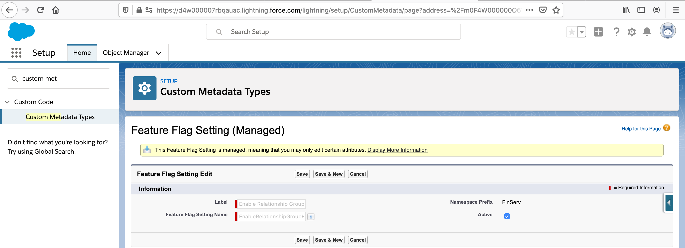
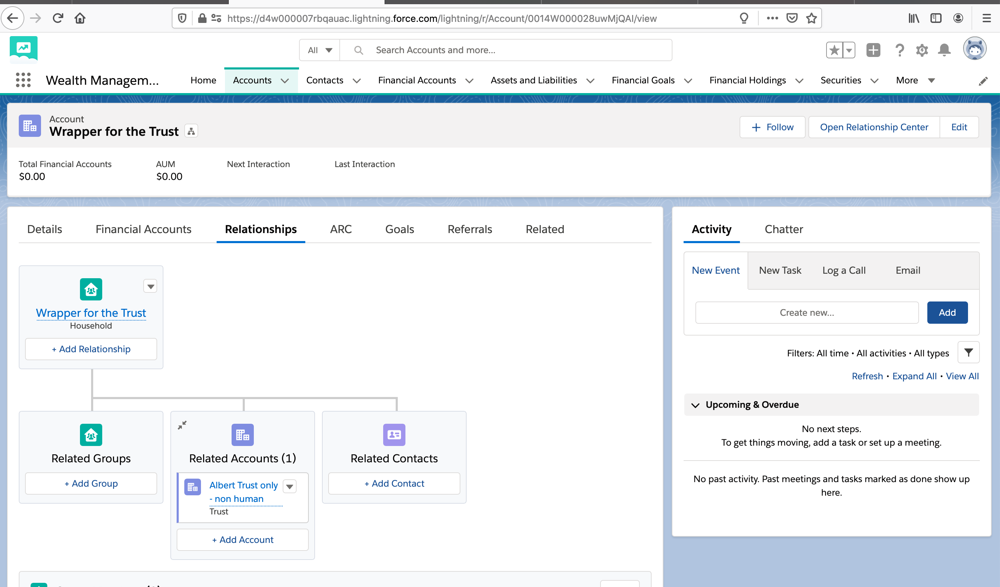
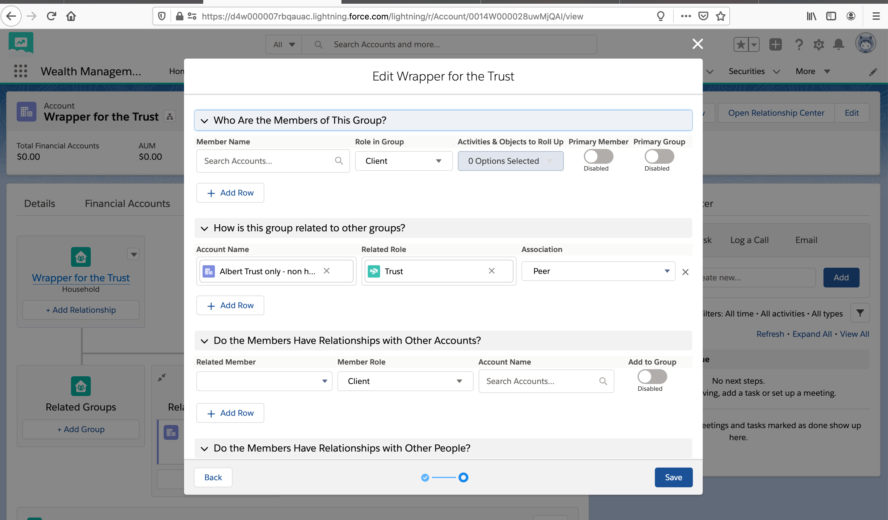

# Demo showing how to model Trust Accounts in Household

## Setup
- Enable the Custom Metadata Types for Expanded Account-Account Relationships

## Demo
- 

## Resources
- [Enable the Custom Metadata Types for Expanded Account-Account Relationships](https://developer.salesforce.com/docs/atlas.en-us.financial_services_cloud_admin_guide.meta/financial_services_cloud_admin_guide/fsc_enable_metadata_aar.htm)
